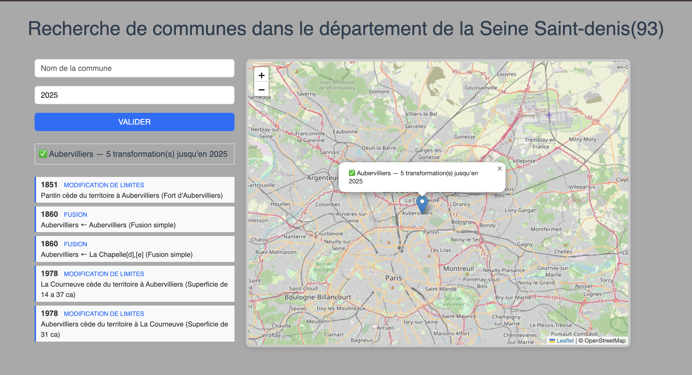

# Évolution des communes de la Seine-Saint-Denis (93)

Application web qui centralise, structure et **cartographie l'histoire administrative**
des communes du département de la Seine-Saint-Denis : fusions, créations,
changements de nom et modifications de limites, de 1790 à aujourd'hui.

Projet réalisé dans le cadre du cours **Humanité Numérique** (L3).



## Aperçu

On recherche une commune et une année : la carte se centre sur la commune actuelle
et une frise chronologique liste toutes les transformations qu'elle a connues
**jusqu'à l'année saisie**.

## Fonctionnalités

- Recherche d'une commune du 93 (correspondance exacte puis approximative)
- Autocomplétion des communes actuelles via une liste de suggestions, tout en
  laissant la **saisie libre** possible — on peut donc rechercher une commune
  disparue (par exemple Pierrefitte-sur-Seine, fusionnée en 2025)
- Carte interactive (Leaflet + OpenStreetMap) centrée sur la commune trouvée
- Frise chronologique des transformations administratives, filtrée par année
- Quatre types de transformations croisés par nom de commune : fusion, création,
  changement de nom, modification de limites

## Stack technique

| Couche        | Technologies                                  |
|---------------|-----------------------------------------------|
| Extraction    | Python, `requests`, `pandas` (`read_html`)    |
| Données       | SQLite                                         |
| Backend / API | Flask                                          |
| Frontend      | HTML, CSS (Bootstrap 5), JavaScript           |
| Cartographie  | Leaflet + OpenStreetMap                        |

## Sources de données

- **Historique** : page Wikipédia « Liste des anciennes communes de la Seine-Saint-Denis ».
  Les quatre tableaux sont extraits avec `pandas.read_html` (gestion automatique des
  cellules fusionnées `rowspan`) et identifiés par leurs colonnes, indépendamment de
  la structure des titres de la page.
- **Données actuelles** : API officielle `geo.api.gouv.fr`
  (nom, code INSEE, population, coordonnées du centre géographique).

## Arborescence

```
.
├── README.md
├── requirements.txt
├── docs/
│   └── interface.png            # capture d'écran de l'application
└── src/
    ├── scrap_csv.py             # scrape Wikipédia -> CSV (tableaux_communes_93/)
    ├── geoApi_to_db.py          # API geo -> table `communes`
    ├── scrap_to_db.py           # CSV -> tables historiques (+ colonne annee)
    ├── tableaux_communes_93/    # snapshot CSV des données scrapées
    ├── back/
    │   ├── app.py               # API Flask + service des fichiers front
    │   └── communes93.db        # base générée (non versionnée)
    └── front/
        ├── index.html
        ├── script.js
        └── style.css
```

## Installation

Prérequis : Python 3.10+.

```bash
git clone https://github.com/Y0AZ/commune-historique.git
cd commune-historique

python -m venv .venv
source .venv/bin/activate        # Windows : .venv\Scripts\activate
pip install -r requirements.txt
```

## Construction de la base et lancement

Le code se trouve dans `src/`. La base `src/back/communes93.db` est créée
automatiquement par les scripts.

```bash
cd src
python geoApi_to_db.py           # table `communes` (nécessite une connexion internet)
python scrap_to_db.py            # tables historiques + colonne `annee`
# python scrap_csv.py            # optionnel : régénère les CSV depuis Wikipédia

cd back
python app.py                    # http://127.0.0.1:5000
```

## API

| Route                            | Description                                            |
|----------------------------------|--------------------------------------------------------|
| `GET /communes`                  | Liste des noms de communes actuelles (autocomplétion)  |
| `GET /commune?nom=...&annee=...` | Commune + transformations jusqu'à l'année indiquée     |

## À propos du filtre par année

L'année saisie agit comme un **seuil** : on affiche les transformations survenues
*jusqu'à cette année incluse*. Les dates de Wikipédia étant du texte libre
(« 1er janvier 2025 »), une colonne `annee` est dérivée à l'import par extraction
de l'année à quatre chiffres.

## Limites et perspectives

- Le rattachement commune ↔ événement se fait par correspondance de nom : une commune
  disparue ou renommée peut apparaître sous plusieurs libellés.
- Perspectives : contours géographiques des communes (GeoJSON), filtres temporels
  plus fins, déploiement en ligne.